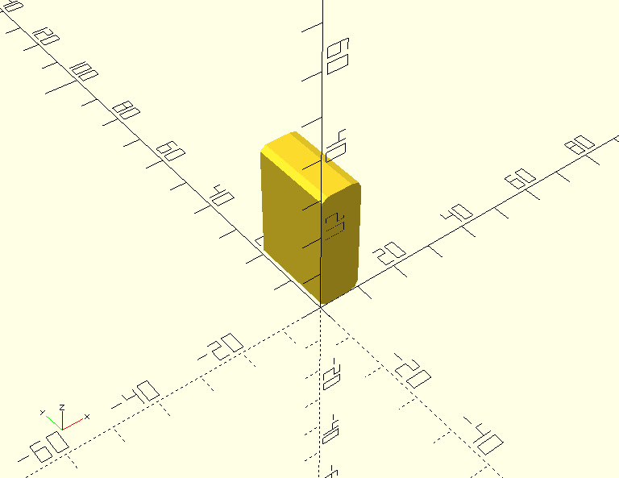

# openscad-libraries
Collection of libraries for openscad

## cube-round.scad

Module to create cubes wit corners rounded in one plane

Usage:
`cube_round(dim=dimension,mki=corner_size,plane="xy|xz|yz")'`

Example:
`cube_round(dim=[10,20,30],mki=4,plane="xz");`

