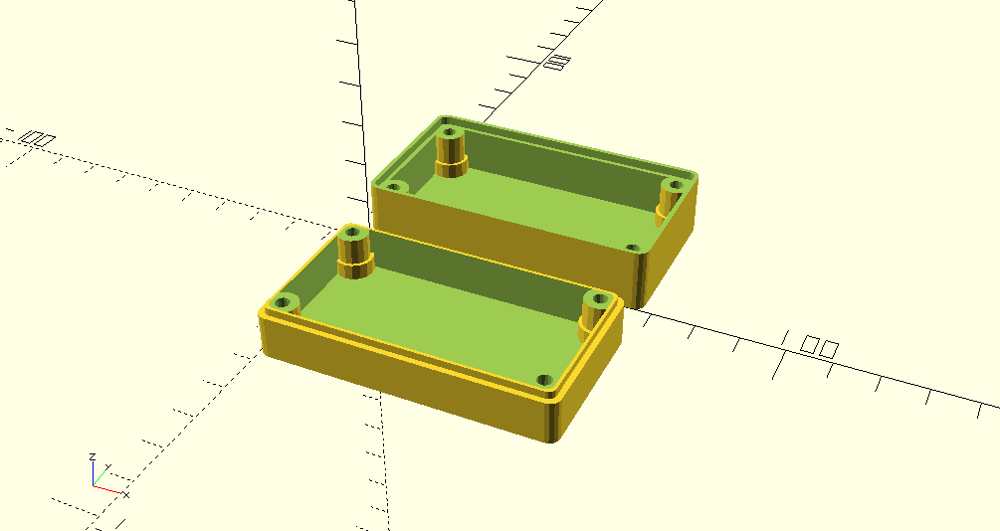

# openscad-libraries
Collection of libraries for openscad

## cube-round.scad

Module to create cubes wit corners rounded in one plane

Usage:
`cube_round(dim=dimension,mki=corner_size,plane="xy|xz|yz")'`

Example:
`cube_round(dim=[10,20,30],mki=4,plane="xz");`


## case.scad

Module to create a screwed case based on the inside dimensions

Usage:
'case(render,dim_inside=,dia_screws,wall,height_top,gap=0.3,mki=5)`

**render**: all,top, bottom<br>
**dim_inside**: dimension of the object that should fit inside<br>
**dia_screws**: diameter of screws to be used<br>
**wall**: wall thickness<br>
**height_top**: height of the lid<br>
**gap**: gap for better fitting lid on bottom<br>
**mki**: roundness of the case<br>

Example:
```
case(render="all",
            dim_inside=[50,20,20],
            dia_screws=3.3,
            wall=2,
            height_top=10,
            gap=0.3,
            mki=5)
```


